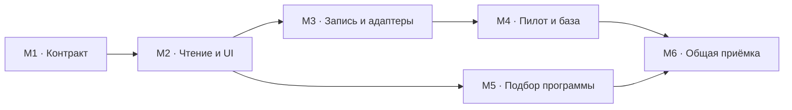

# Карта внедрения многослойной матрицы POI

15.09.2026. **Статус: M1/M2 подключены к main и интерфейсу сайта.**
Исполняемый контракт и 40 примеров — [M1](poi-matrix-m1.md), чтение и UI — [M2](poi-matrix-m2.md).
Отдельная независимая приёмка M1 не проводилась; выполнены авторская и
интеграционная проверки. Живое поле и заполнение матрицы остаются M3/M4.
[География Фудзи](fuji-geography-results-2026-09-15.md) уже внедрена отдельно.
Поручение владельца: один объект должен находиться по всем подтверждённым
функциям, а гид — получать выборку галочками, без выбора «главной» категории.
Фильтры регионов внедряются отдельно и не требуют миграции типов.

## Результат для владельца

В каталоге и при подборе остановок можно выбрать: Кансай, искусство, историческая
архитектура, посещение с детьми. Карточка показывает подходящие свойства и
условия посещения. Агент получает те же значения, источники и причины отбора.

Клиент сообщает пожелания. Гид выбирает места и собирает программу. Матрица
помогает отбору, но не отправляет клиенту автоматически утверждённый маршрут.
На входе уместны приглашения «Подобрать маршрут» и «Адаптировать маршрут под себя»;
они ведут к заявке с пожеланиями, а не к редактору программы гида.

## Что уже есть и чего не хватает

| Область | Рабочий источник | Пробел для матрицы |
|---|---|---|
| Реестр типов | `src/lib/poi-taxonomy.ts`, активный `config/poi-taxonomy.v5.json` | Один основной тип; четыре фасета не покрывают функции и условия |
| Чтение и фильтры | `src/lib/poi-category.ts`, `AdminOperationsConsole.tsx` | Каталог фильтрует по одному типу; старые неоднозначные значения требуют разбора |
| Запись классификации | `poi-taxonomy-airtable.ts`, `classification-contract.mjs`, `poi-ingest.ts` | Четыре поля таксономии; нет доказательств каждого свойства матрицы |
| Дополнение старых мест | `poi-fact-sync.mjs`, команда `poi:sync` | Умеет заполнить пустой тип; не заменяет существующий и не пишет матрицу |
| Факты и редактура | `poi-facts.ts`, `poi-facts-storage.ts`, `PoiFactsPanel.tsx` | Досье уже хранит основания; нужен вывод свойств из конкретных фактов |
| Программы гида | `multi-day-builder-data.ts`, `MultiDayBuilderWorkspace.tsx`, `RouteStopsEditor.tsx` | Общий поиск ищет имена и возвращает первые 12; классификация передаётся одной подписью |
| Профиль гостя | `tourist-profile.ts`, `TouristProfileForm.tsx`, `TouristProfilePanel.tsx` | Возрасты детей, мобильность, интересы, глубина и темп уже есть; нет общего преобразования в подбор POI |
| География POI | `prefectures.ts`, `poi-geography.ts` | Региональная выборка отделена от назначения места; расширенный подбор конструктора — этап M5 |

Срез после [исправления типов Хоккайдо](hokkaido-types-results-2026-09-14.md):
1134 неслужебных POI, из них 693 с каноническим типом, 171 с точным старым
соответствием и 270 с неопределённым типом. **270 — первая очередь миграции,
а не весь её объём.** Остальные карточки тоже нуждаются в проверке дополнительных
свойств. Перед исполнением снять свежий состав по POI ID; эти числа не счётчик
живой базы. Служебные блоки программы не превращаются в туристические места.

## Модель: независимые слои

| Слой | Вопрос | Примеры и границы |
|---|---|---|
| Предмет и масштаб | Что именно описывает карточка? | Гора, здание, музей, комплекс; самостоятельная точка или родитель. Основной тип сохраняется для совместимости, но не ограничивает поиск |
| Функции | Что здесь можно делать? | Смотреть экспозицию, посещать сад, любоваться видом, ехать на канатной дороге. Несколько значений одновременно |
| Темы | Чем место интересно? | История, архитектура, современное искусство, природа, ремёсла. Тема не означает отдельную физическую часть |
| Условия посещения | Когда и как это доступно? | В помещении/на улице, запись, сезонность, длительность, лестницы. Значения и сроки берутся из досье; новых копий расписания не заводить |
| Для кого | Подойдёт ли этой группе? | Семья с детьми определённого возраста, коляска, ограничения подвижности. Утверждение имеет условия и источник |
| Редакторские отметки | Что рекомендует Jumbo? | Выбор гида, знаковый вид. Агент не присваивает редакторское одобрение сам |
| География и связи | Где это и частью чего служит? | Регион → префектура → город; родитель → ребёнок. Это отдельные фильтры и связи, а не категории |

Примеры определяют семантику, но не заменяют будущий исполняемый реестр кодов.
Коды, переводы RU/EN, синонимы, группы и правила совместимости должны иметь
один loader. Не создавать разные словари у адаптеров, интерфейса и агента.

### Сложные места и матрёшка

- Гора с храмом остаётся горой. Храм имеет свою карточку и связь с горой,
  если это подтверждённые самостоятельные места. Наличие храма не даёт всей
  горе тип «Буддийский храм» и не переносит часы храма на тропы.
- Замок с музеем и садом находится по всем подтверждённым функциям. При раздельных
  входах, билетах или программе посещения возможны дети с собственными условиями.
- Для здания, связанного с Nintendo, отдельно проверяются история, архитектура,
  действующая экспозиция и доступ посетителей. Это пример проверки, а не утверждение,
  что в конкретном здании одновременно работают музей и гостиница.
- Гостиница или ресторан внутри комплекса связывается с существующей записью своего
  каталога. Матрица POI не запускает гостиничный мониторинг, не копирует его базу
  и не получает права его писателя; действует изоляция из AGENTS.md § 9.
- Родитель может показывать «Внутри есть музей» со ссылкой на ребёнка. Это не равно
  собственной функции «музей». Не переносить признаки детей на всех соседей.
  Проверять циклы, повторное включение в программу и реальную доступность перехода.
- Действующие исключения владельца сохраняются: центры городов отложены; общего
  родителя Исэ Дзингу пока не регистрировать. Матрица не переоткрывает эти решения.

### «С детьми» без ложных обещаний

В интерфейсе — понятная отметка «С детьми». В данных — подтверждённое свойство,
возрастная область, условия и основание. Если данных нет, состояние «Не проверено»;
оно не означает ни «подходит», ни «не подходит». Детский билет сам по себе не
доказывает пригодность места. Наличие лестниц и доступность с коляской проверяются
отдельно. Гид видит конкретное ограничение: «Вход с 6 лет», «Коляску нужно оставить».

Срок годности нужен изменяемым условиям. Исторический факт не протухает из-за
истечения срока проверки расписания. При противоречии агент проверяет источник
и предмет, сохраняет решение и историю; отсутствие сведения не стирает старое.

## Предлагаемое хранение и совместимость

В M1 подготовлен контракт отдельного поля POI **`POI Matrix`** с документом
`poi-matrix/v1`. **Живого поля пока нет; M3 создаёт его после проверки схемы.**
Проверка предложений и чтение реализованы в M1; подключение к UI — в пакете M2.
Не помещать новые теги в свободный текст Notes
или в старое поле категории.

Документ содержит версию реестра, свойства с состоянием проверки, условия,
авторство и ссылки на факты: POI ID, идентификатор факта, digest досье, источник
и дата проверки. Не копирует статью и не дублирует фактическое досье. Для каждого
утверждения понятен его предмет — сам POI или названная связанная часть.

`POI Type` и существующие поля таксономии остаются совместимой проекцией на время
перехода. Новые свойства не нужно втискивать в четыре старых фасета. Новый reader
выбирает матрицу, а при её отсутствии сохраняет нынешнее чтение типов. Повреждённая
матрица явно отмечается; старое значение не скрывает ошибку. Ни пустая строка,
ни отсутствие матрицы не превращаются в отрицательные признаки.

В списки отдавать только компактную проекцию для поиска и подписей. Доказательства
загружать в карточке по требованию, как сегодня досье. Если понадобятся поля-индексы
Airtable, они выводятся из того же документа и не становятся вторым местом правки.

M1 должен закрепить связь матрицы и совместимого типа для составного POI: технический
основной тип выбирается один раз по предмету, пользователь выбирает сразу несколько
функций. Смена выбранных галочек не должна произвольно менять основной тип.

Географический охват места может включать несколько префектур: горный массив
или переправа не равны выбранной точке на карте. В M1 определить этот охват
отдельно от префектуры точки; не записывать список через запятую в прежнее поле.
Слой «География и связи» реализован отдельно и интегрирован с матрицей M1/M2 — контракт
`poi-geography/v1` в [poi-geography-contract.md](poi-geography-contract.md):
поле `POI Geography`, подтверждённые территории в фильтрах, отношения «вид на»,
«посвящён», «точка посещения» отдельно от `Parent POI`. Матрица его не
переоткрывает и второго места для охвата не заводит.
Нынешнее поле префектуры относится к сохранённой точке POI. Оно заполняется
по подтверждённому адресу или положению точки уже сейчас; внедрение охвата
несколькими префектурами не является условием такого заполнения.
Основание: [сверка пропусков метаданных](metadata-completeness-2026-09-14.md).

## Этапы внедрения

| Этап | Что сделать | Что предъявить на приёмке | Статус |
|---|---|---|---|
| M1. Контракт и эталоны | Реестр слоёв, состояний, правил и хранения; 30–50 разных POI как эталоны | Гора/храм, замок/музей/сад, аквариум, общественное здание, комплекс, туристический транспорт и семейные ограничения представлены; нет обязательного выбора единственной функции | Готов к приёмке: контракт, 40 примеров; семейный сценарий синтетический |
| M2. Общее чтение и интерфейс | Reader/validator и компактная проекция; галочки и подписи в админке, просмотр источников; совместимость со старой базой | Старая карточка видна, новая находится по нескольким функциям; одинаковые фильтры дают те же POI ID; телефон и клавиатура работают | Реализован в ветке, проверка M2 |
| M3. Запись и все адаптеры | Расширить существующие Intake и sync; проверять предложение по фактам и схеме; импортировать новые свойства и дополнять известные | Сквозные тесты обоих путей, повтор без лишней записи, отказ по чужому факту, дрейфу и неподтверждённому исходу; понятный отчёт изменений | Не начат |
| M4. Пилот и миграция базы | Пилот 50 карточек; затем оставшиеся из 270, затем остальная база партиями до 100 | Отчёт old → new по каждому POI, независимая сверка записи, исход у каждого ID; нет потерь фактов, описаний, связей и статусов | Не начат |
| M5. Подбор программы и профиль | Общий поиск для конструктора и остановок; пожелания гостя → объяснимые фильтры/приоритеты; сохранённые наборы фильтров | Гид получает подходящую выборку, объяснение совпадений и неизвестных условий; добавление POI сохраняет связи, время, стоимость и ручные правки программы | Не начат |
| M6. Завершение перехода | Подключить остальные читатели и карточки, свести диагностику, проверить обе языковые версии и обновить документацию агентов | Все потребители читают одну проекцию; для всей базы есть состояние матрицы; старое поле не управляет новым поиском; работающий импорт не создаёт новый долг | Не начат |

M5 можно разрабатывать на принятых эталонах после M2. Живой подбор проверяется
после пилота M4. Парсинг порталов продолжает работать по принятому контракту до
переключения M3; переписывать все адаптеры независимо друг от друга не требуется.

Один этап может состоять из нескольких небольших коммитов. Его закрывают по
работающему результату, а не числу файлов, тестов или часам агента. Исполнитель
готовит пакет и доказательства; независимый аудитор проверяет контракт и опасные
границы записи. Владельцу адресуют только нерешённый выбор предмета/политики,
который нельзя установить по источникам. Не возвращать ему технические отказы.

## Фильтры и пользовательские сценарии

**Сейчас, отдельное улучшение:** в `/admin/seo-llm` регион и префектура добавлены
перед уточнением направления. Регион строится по префектуре POI, а не по маршрутному
`Site City`. Основа — [группировка Japan Tourism Agency](https://www.mlit.go.jp/tagengo-db/en/),
Окинава выделена отдельно; Миэ входит в Кансай. Счётчики регионов показывают весь
каталог, счётчики префектур — выбранный регион. Итог «Найдено» учитывает все фильтры.

При смене региона сохраняются совместимые дочерние значения, остальные сбрасываются.
Site City подписан «Направление», а в строке списка и метаданных карточки
показана префектура. Направление может объединять несколько мест и не является
адресом. Текущий reader не вычисляет префектуру из подписи направления.
Есть сброс всей географии; тип, статус и поиск он сохраняет. Без префектуры или при
противоречии RU/EN запись доступна через «Регион не определён» и в общем списке.
Из названия города принадлежность не угадывается. Фильтрация не меняет поля базы.

Проверка общего reader на живом списке 14.09.2026: регион определён у 1099 из 1134
POI; у 29 префектура отсутствует, у шести значение не распознано. Эти 35 записей
остаются видны. Это отдельный географический показатель, не остаток классификации
из 270 карточек. Артефакт: `tmp/poi-matrix-regions-2026-09-14/live-geography.json`,
12 GET, записей нет. Уточнение таких полей учитывать в подготовке данных M4 отдельно
от типов, не выводить принадлежность по маршрутному городу.

Последующая сверка в тот же день выявила причину шести нераспознанных значений:
прежние RU-написания при правильном EN. Общий нормализатор исправлен; на исходном
снимке он определяет регион у 1105 записей, оставляя 29 действительно пустых.
[Разбор причин и отдельное дополнение черновиков](metadata-completeness-2026-09-14.md).
По следующему замечанию владельца заполнены и четыре оставшиеся префектуры
сохранённых точек. Исторические счётчики выше не описывают текущий остаток.

**M2:** группы галочек «Чем заняться», «Темы», «Условия», «С детьми». Внутри группы
по умолчанию достаточно одного совпадения (ИЛИ), между группами требуется совпадение
всех условий (И). Выбранные ограничения видны над результатами и удаляются по одному.
Для сочетания нескольких обязательных функций — явный режим «Все выбранные».
Не менять ИЛИ на И без подписи. Пустая выборка показывает, какое условие её сузило,
и предлагает снять именно его; не ослабляет фильтры автоматически.

**M5:** строгие ограничения и предпочтения различаются. Возрастной запрет исключает
место; интерес к искусству повышает его приоритет. Неизвестная доступность не проходит
фильтр «Только с подтверждённым доступом», но остаётся в отдельной видимой группе.
Запрос, сортировка, страница и счётчики используют один predicate/контракт на сервере.
Фильтрация идёт до ограничения выдачи; текущие первые 12 результатов по имени не
могут быть основой регионального поиска. Для большой выдачи нужна пагинация.

## Анкета без новых обязательных шагов

Уже собранные возраст детей, мобильность, интересы, глубина и темп используются
повторно. Не просить эти сведения в каждом маршруте заново.

- В существующем шаге интересов оставить быстрые карточки. Внутри выбранной темы
  раскрывать необязательные уточнения: искусство → современное/традиционное,
  активность → прогулка/поход. Свободный ответ и «Порекомендуйте» сохраняются.
- Возраст из состава группы предлагает семейный профиль, но не включает все галочки
  доступности за клиента. Уточнения о коляске показывать по контексту на том же шаге.
- Перед отправкой показать короткое резюме пожеланий с возможностью изменить их.
  Формулировка «Подобрать маршрут» означает передачу этих пожеланий гиду.
- Для готовой экскурсии «Адаптировать маршрут под себя» передаёт исходный маршрут
  и пожелания в тот же профиль. Не перезаписывает авторскую экскурсию.
- Профиль → фильтры выполняет один версионированный преобразователь с объяснениями.
  Различие существующих payload `tourist-profile.ts` и полей `prospects.ts` решить
  на этой границе; второго списка интересов в интерфейсе не заводить.

Сначала применить текущие ответы; новые необязательные поля добавлять лишь там,
где интерфейс действительно собирает сведения. Отсутствующий ответ не выдавать
за предпочтение клиента. Контактные и прочие личные сведения не нужны в отчёте
качества матрицы — достаточно обезличенных сценариев.

## Миграция и критерии остановки

Сначала отчёт предложений, затем проверка, затем запись через общий writer.
Отдельный миграционный профиль потребуется для замены уже заполненных типов:
нынешний `poi:sync` её намеренно запрещает. Не снимать этот запрет ради массового
прохода. Полномочия на матрицу, схему и изменение опубликованных карточек должны
соответствовать конкретной партии и текущему поручению; создание этой карты само
по себе живую миграцию не запускает.

Сохранить снимок прежних полей, точные ID, версию кода/реестра и основания каждого
предложения. Все строки проверяются до записи, затем старые значения перечитываются
перед своим PATCH. Успешная часть партии имеет журнал и независимое чтение. При
ошибке остановить остаток и сверить уже применённое; автоматический откат не обещать.

Для каждого ID — один исход: обновлён, уже соответствует, не хватает доказательств,
нужно решение владельца или технический отказ. Сумма равна составу партии; неизвестные
свойства допустимы и не требуют выдумывать значения ради 100% заполнения.
Обновления описаний и публикация не смешиваются с миграцией классификации.

Обязательные контрпримеры: гора с храмом; ребёнок с другой функцией; несколько
объектов одного адреса; закрытая экспозиция; детский билет без сведений о доступности;
просроченное ограничение; чужой fact ID; неполная матрица; повтор после потерянного
ответа PATCH; равные фильтры в админке и конструкторе. Семантические изменения реестра
выпускать новой версией, сохраняя чтение уже записанных значений.

Метрики: доля записей с проверенным предметом, покрытие функций и условий по отдельности,
число конфликтов и задач владельца, сохранность ID, точность на эталонах, одинаковость
выборки у всех читателей. Исправить старый `no_category` в `check-poi-integrity.mjs`:
сейчас он считает пустое legacy-поле, даже если канонический тип уже записан.

## Следующее поручение исполнителю

Принять **M1** по [контракту и примерам](poi-matrix-m1.md), затем идти к M2.
Проверить ограничения синтетического семейного сценария и старого чтения двух
карточек; наличие примера не означает проверенную живую классификацию этих POI.
Базу пока не мигрировать. География/связи крупных родителей находятся в отдельной
задаче Claude Code; их код и списки не дублировать в матрице.
